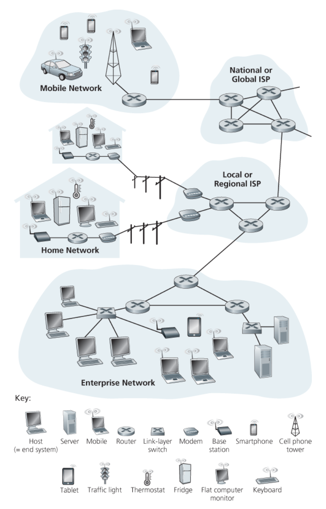
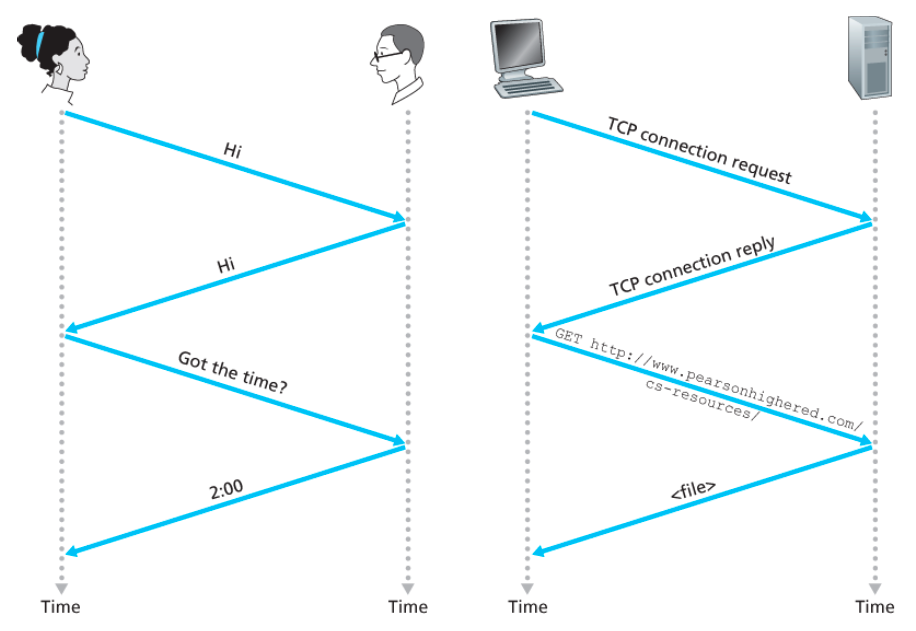

# 1.1 인터넷이란 무엇인가?

- 인터넷을 구성하는 기본적인 하드웨어와 소프트웨어 구성요소를 기술하는 것
- 분산 애플리케이션에 서비스를 제공하는 네트워킹 인프라스트럭처 관점에서의 인터넷을 기술하는 것

 

## 1.1.1 구성요소로 본 인터넷

### 인터넷(Internet)

- Network of Network
- 전 세계의 컴퓨팅 장치를 연결하는 컴퓨터 네트워크

### 호스트(host), 종단 시스템(end system)

- 컴퓨터 네트워크에 연결된 컴퓨팅 장치
- ex) 서버(데스트톱 PC, 리눅스 워크스테이션 등), 스마트폰, 태블릿, 사물(가전제품, 시계, 자동차 등)
- `통신링크(communication link)`와 `패킷 스위치(packet switch)`의 네트워크로 연결됨

### 링크(link)

- 동축케이블, 구리선, 광케이블, 라디오 스펙트럼을 포함한 다양한 물리 매체(physical media)로 구성됨
- `전송률(transmission rate, 링크 대역폭)`: 데이터를 전송하는 전송률로 `bps(bit per second)` 단위를 사용

### 패킷(packet)

- 한 종단 시스템이 다른 종단 시스템으로 보낼 데이터를 가지고 있을 때, 송신 종단 시스템은 그 데이터를 `세그먼트(segment)`로 나누고 각 세그먼트에 `헤더(header)`를 붙임
- 이렇게 만들어진 정보 패키지를 컴퓨터 네트워크에서 패킷이라고 부름
- 패킷은 목적지 종단 시스템으로 네트워크를 통해 보내지고 목적지에서 원래의 데이터로 다시 조립됨

### 패킷 스위치(packet switch), 교환기

- 패킷 스위치는 입력 통신 링크의 하나로 도착하는 패킷을 받아서 출력 통신 링크의 하나로 그 패킷을 전달함 ( = 최종 목적지 방향으로 패킷을 전달)
- 종류
  - `라우터(router)`: 접속 네트워크에서 사용
  - `링크 계층 스위치(link-layer switch)`: 네트워크 코어에서 사용

### 경로(route or path)

- 패킷이 송신 종단 시스템에서 수신 종단 시스템에 도달하는 동안 거쳐온 일련의 통신 링크와 패킷 스위치

### ISP(Internet Service Provider)

- 패킷 스위치와 통신 링크로 이루어진 네트워크
- 종단 시스템에게 케이블 모뎀이나 DSL 같은 가정용 초고속 접속, 고속 LAN 접속, 이동 무선 접속 등 다양한 네트워크 접속 제공
- CP(content provider)에게 인터넷 접속을 제공하여 웹 사이트나 비디오 서버를 인터넷에 직접 연결할 수 있게 됨
- 인터넷은 종단 시스템을 서로 연결하는 것이므로 하위 계층 ISP들은 국가 그리고 국제 상위 ISP를 통해 서로 연결됨

### 프로토콜(protocol)

- 인터넷에서 정보의 송수신을 제어
- TCP/IP
  - TCP(Transmission Control Protocol)
  - IP(Internet Protocol): 라우터와 종단 시스템 사이에서 송수신되는 패킷 포맷을 기술

### Standards

- 각각의 프로토콜 또는 모든 프로토콜이 무엇을 수행하는지에 대해 합의하는 것도 매우 중요하며 이를 통해 상호 호환되는 시스템과 제품을 만들 수 있음 → 표준을 만드는 이유
- IETF(Internet Engineering Task Force)
  - 국제 인터넷 표준화 기구
  - RFC(Requests for Comment): IETF 표준 문서
  - TCP, IP, HTTP, SMTP 같은 프로토콜 정의
- IEEE 802 LAN 표준위원회
  - 이더넷과 무선 와이파이 표준을 기술

 

## 1.1.2 서비스 측면에서 본 인터넷

### 애플리케이션에 서비스를 제공하는 인프라스트럭처

- 인터넷을 다른 관점에서 기술하는 정의
- 애플리케이션
  - 전통적: 전자메일, 웹 서핑
  - 모바일 스마트폰, 태블릿 애플리케이션: 인터넷 메시징, 실시간 도로 교통 정보를 반영한 지도 서비스, 음악 스트리밍, 영화 및 텔레비전 스트리밍 ..
- 인터넷 애플리케이션은 종단 시스템에서 수행됨 = 네트워크 코어에 있는 패킷 교환기에서 수행되지 않음
  - 패킷 교환기는 종단 시스템 간의 데이터 교환을 쉽게 해주지만 데이터의 시작과 끝인 애플리케이션에는 관심이 없음

### 분산 애플리케이션(distributed appllication)

- 모바일 스마트폰, 태블릿 애플리케이션은 서로 데이터를 교환하는 많은 종단 시스템을 포함하고 있기 때문에 분산 애플리케이션이라고도 부름

### 소켓 인터페이스(socket interface)

- 인터넷에 접속한 한 종단 시스템에서 수행되는 프로그램이 어떻게 인터넷 인프라스트럭처의 다른 종단 시스템에서 수행되는 특정 목적지 프로그램으로 데이터를 전달하도록 요구하는지를 명시
- 송신 프로그램이 따라야 하는 규칙의 집합
- 인터넷은 이 규칙에 따라 데이터를 목적지 프로그램으로 전달

 

## 1.1.3 프로토콜이란 무엇인가?

> 💡 둘 이상의 통신 개체(entity)가 어떤 일을 함께 수행하려면 이들이 다같이 인식하는 프로토콜 즉, 통신 규약이 필요함

### 사람 프로토콜과 컴퓨터 네트워크 프로토콜

- 메시지의 송수신과 메시지를 송수신 할 때 취하는 행동은 프로토콜의 중심에 있음
- 하나가 다른 프로토콜을 수행한다면 그 프로토콜은 다른 이들과 상호작용 할 수 없으며, 원하는 작업을 수행할 수 없게 됨

### 네트워크 프로토콜

- `프로토콜`: 둘 이상의 통신 개체 간에 교환되는 메시지 포맷과 순서 뿐만 아니라, 메시지의 송수진과 다른 이벤트에 따른 행동들을 정의
- 통신하는 둘 이상의 원격 객체가 포함된 인터넷에서의 모든 활동은 프로토콜이 제어함
- `혼잡 제어(congestion-control) 프로토콜` : 종단 시스템에 존재하며, 송수진자 간에 전송되는 패킷 전송률을 조절함
- `라우터에서의 프로토콜` : 출발지(source)에서 목적지(destination)까지의 패킷 경로를 설정
