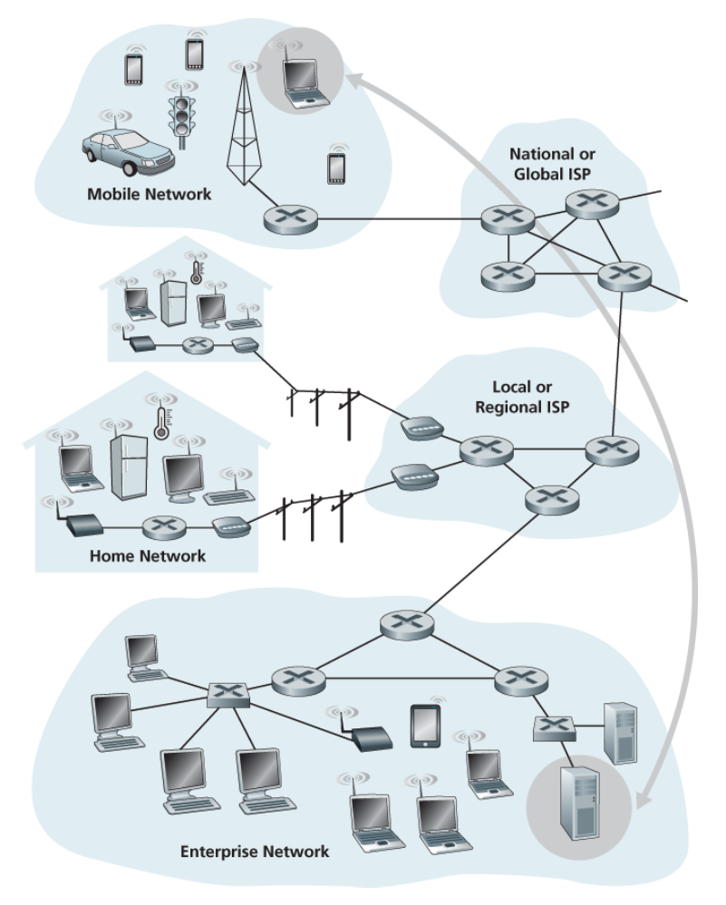
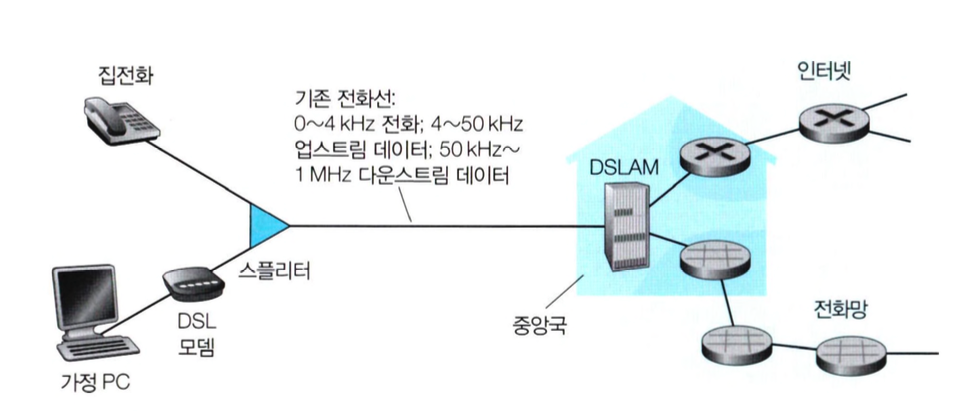
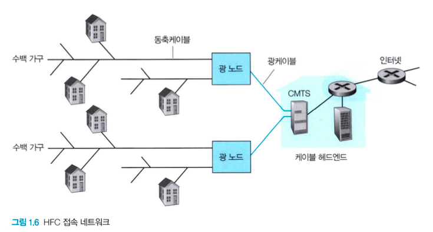
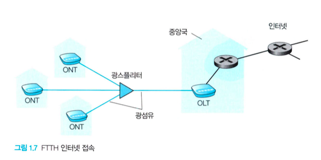
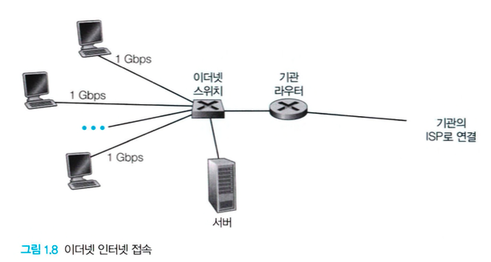

# 1.2 네트워크의 가장자리

### 호스트(host), 종단 시스템(end system)

- 인터넷에 연결되는 컴퓨터와 그 밖의 장치들
- 종단 시스템은 애플리케이션을 수행하므로 `호스트(host)`라고도 부름
- 호스트는 `클라이언트(client)`와 `서버(server)`로 구분
  

 

## 1.2.1 접속 네트워크

### 가정 접속: DSL, 케이블, FTTH, 5G 고정 무선

### DSL(Digital Subscriber Line) 인터넷 접속

- 가정은 유선 로컬 전화 서비스를 제공하는 같은 지역 전화 회사(telco)로부터 DSL 인터넷 접속 서비스를 받음
  
- 가정의 DSL 모뎀은 `지역 전화 회사(telco)`의 `지역 중앙국(Central Office, CO)`에 위치한 `DSLAM(Digital Subscriber Line Access Multiplexer)`과 데이터를 교환하기 위해 기존 전화 회선을 사용함
  1. 가정의 DSL 모뎀은 수신한 디지털 데이터를 전화선을 통해 CO로 전송하기 위해, 해당 데이터를 고주파 신호로 변환
  2. 여러 가정으로부터의 아날로그 신호는 DSLAM에서 디지털 포맷으로 다시 변환됨
- `스플리터(splitter)`: 가정에 도착하는 데이터와 전화 신호를 분리하고 데이터 신호를 DSL 모뎀으로 전송함
- `DSLAM(Digital Subscriber Line Access Multiplexer)`: 데이터와 전화 신호를 분리하고 데이터를 인터넷으로 송신함

### 케이블 인터넷 접속, HFC(Hybrid Fiber Coax)

- 가정은 케이블 TV 서비스를 제공하는 같은 회사로부터 인터넷 접속 서비스를 받음
- 광케이블은 케이블 헨드엔드를 이웃 레벨 정션(junction)에 연결하며, 이로부터 가정에 도다라하는 데에는 전통적인 동축케이블이 사용됨
  
- `케이블 모뎀`: 외장형 장치이고 이더넷 포트를 통해 가정 PC에 연결됨
  - HFC 네트워크를 2개의 채널, 다운스크림과 업스트림 채널로 나눔
  - `CMTS(cable modem termination system)`: DSL 네트워크의 DSLAM과 유사한 기능을 제공
  - DSL과 마찬가지로 비대칭이며 보통 다운스트림 채널이 업스트림 채널보다 빠른 전송률이 할당됨
- `공유 방송 매체`: 케이블 인터넷의 중요한 특성
  - 헤드엔드가 보낸 모든 패킷이 모든 링크의 다운스트림 채널을 통해 모든 가정으로 전달됨
  - 가정에서 보낸 모든 패킷은 업스트림 채널을 통해 헤드엔드로 전달됨
  - `분산 다중 접속 프로토콜` → 전송을 조정하고 충돌을 피하기 위해서 필요

### FTTH(fiber to the home)

- CO로부터 가정까지 직접 광섬유 경로를 제공함
- 잠재적으로 Gbps의 인터넷 접속 속도를 제공할 수 있음
- 광신호 분배 기술: CO로부터 가정까지 광신호를 분해하는 기술들을 말함
  - `다이렉트 광섬유(direct fiber)` : 가장 간단한 광신호 분배 네트워크로 CO에서 각 가정으로 하나의 광섬유를 제공
  - `AON(Active Optical Network)`과 `PON(Passive Optical Network)` : 스플리팅을 수행하는 두 가지 경쟁적인 광신호 분배 네트워크 구조
- `스플리팅(splitting)` : 일반적으로 CO에서 시작되는 각 광섬유는 여러 가정이 공유하기 때문에, 가정에 가까운 곳까지 하나의 광섬유로 온 다음 고객별 광섬유로 분리하는 것
  - `AON`: 근본적인 `교환(switched)` 이더넷
  - `PON`: 각 가정에서 홈 라우터를 ONT에 연결하고, 그를 통해 인터넷에 접속하는 방식(사진 참고) 1. 각 가정은 `ONT(Optical Network Terminator)`를 가지고 있으며, 이는 지정된 광섬유로 이웃 스플리터에 연결됨 2. `스플리터(Optical Splitter)`는 여러 가정을 하나의 공유 광섬유로 결합, 이를 telco의 CO에 있는 `OLT(Optical Line Terminator)`에 연결 3. OLT는 광신호와 전기 신호 간의 변환을 제공, 이는 telco 라우터를 통해 인터넷에 연결됨
    

### 5G 고정 무선(5G Fixed Wireless, 5G-FW) 기술

- `빔포밍(beam-forming)` 기술을 이용하여 서비스 제공가의 기지국에서 가정 내의 모뎀으로 데이터를 무선으로 전송
- `와이파이(WiFi)` 무선 라우터가 케이블 또는 DSL 모뎀에 연결되어 있듯, 5G-FW에서도 와이파이 무선 라우터가 모뎀에 연결되어 있음
- `5G 셀룰러(cellular)` 네트워크

---

### 기업(그리고 가정) 접속: 이더넷과 와이파이

### LAN(Local Area Network)

- 종단 시스템을 가장자리 라우터에 연결하는 데 사용됨
- 여러 유형의 LAN 기술이 있지만 이더넷 기술이 기업, 대학, 홈 네트워크에서 가장 널리 사용되는 기술임

### 이더넷(Ethernet)

- 이더넷 스위치에 연결하기 위해 꼬임 쌍선을 이용
- 이더넷 스위치 혹은 상호연결된 스위치들의 네트워크는 더 큰 인터넷으로 연결됨
  

### 무선 랜(wireless LAN) 환경

- 사람들은 인터넷을 '사물(스마트폰, 태블릿 등)'에서 무선으로 접속하고 있음
- 무선 랜 환경에서 무선 사용자들은 기업 네트워크에 연결된 `AP(Access Point)`로 패킷을 송•수신
- `와이파이(WiFi)`: IEEE 802.11 기술에 기반한 무선 랜 접속

---

### 광역 무선 접속: 3G, LTE 4G와 5G

- 아이폰과 안드로이드 장치 같은 이동 장치들이 이동 전화망 사업자들이 운영하는 기지국을 통해 패킷을 송수신하는데 사용하는 것과 같은 무선 인프라스트럭처를 채택하고 있음

 

## 1.2.2 물리 매체

- 물리 매체를 정의하기 위해서는 비트에 대해 먼저 알아야 함

  - 비트는 여러 라우터를 거치게 됨
    - 첫 번째 라우터 : 비트를 수신 & 전송 → 두 번째 라우터 : 비트를 수신 & 전송 → 세 번째 라우터 : …
  - 즉, 비트는 출발지에서 목적지로 전달될 때 여러 번 걸쳐 전송되며, 일련의 송신기-수신기 쌍을 거치게 됨
  - 비트는 물리 매체(physical media)상에 전자파나 광 펄스를 전파하여 전송

- 물리매체는 여러 형태이며, 경로상의 각 송신기-수신기 쌍에 대해 같은 유형일 필요는 없음

- 물리 매체 분류

  - 유도 매체(유선): 견고한 매체를 따라 파형을 유도
  - 비유도 매체(무선): 대기와 야외 공간으로 파형을 전파

  | 유형 | 전송 매체                          |
  | ---- | ---------------------------------- |
  | 유선 | 꼬임쌍선, 동축케이블, 광케이블     |
  | 무선 | 지상 라디오 채널, 위성 라디오 채널 |

### 꼬임쌍선

- 가장 싸고 가장 많이 이용하는 전송 매체
- 구성
  - 2개의 절연 구리선, 각각은 약 1mm 굵기로 규칙적인 나선 형태로 배열됨
  - 이웃하는 쌍들 간에 전기 간섭을 줄이기 위해 선들이 꼬여 있는 것이며, 이러한 한 쌍의 선이 하나의 통신 링크를 구성
- 데이터 전송률 : 전송선의 두께, 송신기와 수신기 사이의 거리에 따라 다름
- 사용 : UTF(Unshielded Twisted Pair) - 빌딩의 컴퓨터 네트워크, LAN에서 가장 많이 이용하는 매체

### 동축케이블

- 꼬임쌍선처럼 2개의 구리선으로 되어 있으나, 두 구리선이 평행하지 않고 동심원 형태를 이룸
- 데이터 전송률 : 동심원 형태의 구조와 특수 절연 및 차폐를 가지고 있어 꼬임쌍선보다 더 높은 데이터 전송률을 얻을 수 있음
- 사용 : 케이블 TV 시스템
- 특징
  - 유도 공유 매체(shared medium)으로 사용할 수 있음
- 여러 종단 시스템은 케이블에 직접 연결할 수 있고, 모든 종단 시스템은 다른 종단 시스템이 전송하는 모든 것을 수신함

### 광섬유

- 비트를 나타내는 빛의 파동을 전하는 가늘고 유연한 매체
- 특징:
  - 초당 10~100기가비트에 이르는 높은 비트율을 지원
  - 고가이므로 근거리 전송(LAN, 가정)에는 이용하기 어려움
  - 전자기성 간섭에 영향을 받지 않음
  - 100 km까지는 신호 감쇠 현상이 매우 적음
  - 태핑(tapping, 도청)하기가 어려움
- 사용 : 해저 링크, 광역 전화 네트워크

### 지상 라디오 채널

- 전자기 스펙트럼으로 신호를 전달
- 특징
  - 물리 선로를 설치할 필요가 없음
  - 벽을 관통할 수 있음
  - 이동 사용자에게 연결성을 제공하며, 먼 거리까지 신호 전달이 가능
  - 전파 환경과 신호가 전달되는 거리에 많은 영향을 받음
    - 주변 환경을 결정하는 요소
      - `경로손실(path loss)`
      - `섀도 페이딩(shadow fading)` : 신호가 먼 거리를 지나감에 따라 / 방해 물질을 돌아가거나 통과함에 따라 신호 강도가 약해지는 현상
      - `다중경로 페이딩` : 간섭 물체의 신호 반사 때문
      - `간섭` : 다른 라디오 채널이나 전자기 신호 때문
- 분류
  - 1~2 m의 매우 짧은 거리에서 동작하는 채널 (무선 헤드셋, 키보드 등)
  - `로컬 라디오 채널` : 십~수백 미터에 걸쳐 근거리 네트워크로 동작하는 채널 (무선 랜 기술)
  - `광역 라디오 채널` : 수십 킬로미터에 걸쳐 광역에서 작동하는 채널 (셀룰러 접속 기술)

### 위성 라디오 채널

- 지상 스테이션이라는 둘 이상의 지상 기반 마이크로파 송신기/수신기를 연결
- 과정
  1. 한 주파수 대역으로 전송 신호를 수신
  2. `리피터(repeater)`를 통해 그 신호를 재생
  3. 그 신호를 다른 주파수 대역으로 전송
- 전송률 : Gbps(초당 기가비트)
- 두 가지 종류
  - `정지 위성(geostationary satellite)` : 지상 36,000 km에 쏘아올려져 일정 위치에 영원히 머무름
  - `저궤도 위성(low-earth orbiting(LEO) satellite)` : 지구를 공전하며 지상국뿐만 아니라 서로 통신할 수 있음
