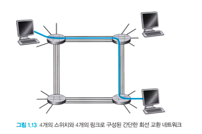

# 1.3 네트워크 코어

- 인터넷의 종단 시스템을 연결하는 패킷 스위치와 링크의 그물망(mesh)을 좀 더 자세히 살펴보면, 그림 1.10의 굵은 선이 네트워크 코어를 나타냄
  
- 링크와 스위치를 네트워크를 통해 데이터를 이동시키는 방식에는 `회선 교환(circuit switching)`과 `패킷 교환(packet switching)`이 있음

 

## 1.3.1 패킷 교환

- 네트워크 애플리케이션에서 종단 시스템들은 `메시지(message)`를 교환
- 출발지 종단 시스템에서 목적지 종단 시스템으로 메시지를 보내기 위해 송신 시스템은 긴 메시지를 `패킷(packet)`이라는 단위로 분할함
- 송신 측과 수신 측 사이에서 각 패킷은 통신 링크와 패킷 스위치(packet switch, 라우터와 링크 계층 스위치)를 거치게 됨
- 패킷은 최대 전송률과 같은 속도로 각각의 통신 링크에서 전송됨
  - 출발지 종단 시스템 혹은 패킷 스위치가 `R(bit)/Second`의 속도로 링크에서 Lbit의 패킷을 송신한다면 그 패킷을 전송하는 데 걸리는 시간은 `L/R`초임

### 저장-후-전달(store-and-forward transmission)

- 대부분의 패킷 스위치가 사용하는 방식
- 스위치가 출력 링크로 패킷의 첫 비트를 전송하기 전에 전체 패킷을 받아야 함을 의미
- 라우터는 보통 여러 개의 링크를 가짐 → 라우터의 기능이 입력되는 패킷을 출력 링크로 교환하는 것이기 때문
  
- 사진에서 패킷 1의 일부분은 전송되었고 패킷 1의 앞쪽이 이미 라우터에 도착함
- 그러나 store-and-forward transmission 방식이므로 라우터는 수신한 비트를 전송할 수 없음
- 대신 버퍼에 패킷1의 비트를 먼저 저장한 후, 라우터가 패킷의 모든 비트를 수신한 후에만 출력 링크로 그 패킷을 전송하기 시작함

### 큐잉 지연과 패킷 손실

- 각 패킷 스위치는 접속된 여러 개의 링크를 가지고 있음
- 각 링크에 대해 패킷 스위치는 `출력 버퍼(output buffer, 출력 큐)`를 갖고 있으며 그 링크로 송신하려는 패킷을 저장하고 있음
- 도착하는 패킷이 한 링크로 전송되어야 하는데, 그 링크가 다른 패킷을 전송하고 있다면 도착하는 패킷은 출력 버퍼에서 대기해야 함 → `큐잉 지연(queuing delay)`
- 버퍼 공간의 크기가 유한하기 때문에 도착하는 패킷은 버퍼가 전송을 위해 대기 중인 다른 패킷들로 꽉 차 있는 경우 `패킷 손실(pack loss)`이 발생
  - 도착하는 패킷 또는 큐에 대기 중인 패킷을 폐기(drop)

### 포워딩 테이블과 라우팅 프로토콜

- 인터넷에서 모든 종단 시스템은 IP 주소를 가짐
- 출발지 종단 시스템이 패킷을 목적지 종단 시스템에 보내고자 할 때, 출발지는 패킷의 헤더에 목적지의 IP 주소를 포함함
- 패킷이 네트워크의 한 라우터에 도착하면 라우터는 패킷의 목적지 주소의 일부를 조사하고 그 패킷을 이웃 라우터로 전달함
- 각 라우터는 목적지 주소(or 목적지 주소의 일부)를 라우터의 출력 링크로 매핑하는 `포워딩 테이블(forwarding table)`을 갖고 있음
- 패킷이 라우터에 도착하면 라우터는 올바른 출력 링크를 찾기 위해 주소를 조사하고 이 목적지 주소를 이용하여 포워딩 테이블을 검색한 후 해당 패킷을 출력 링크로 보냄
- 인터넷은 자동으로 포워딩 테이블을 설정하는데 이용되는 여러 `라우팅 프로토콜(routing protocol)`을 갖고 있음

 

## 1.3.2 회선 교환

- 회선 교환 네트워크에서 종단 시스템 간에 통신을 제공하기 위해 경로상에 필요한 `자원(버퍼, 링크 전송률)`은 `세션(session)` 동안에 확보 또는 `예약(reserve)`됨
  - 패킷 교환 네트워크에서는 이러한 자원을 예약하지 않음
- 세션 메시지는 온디맨드(on-demand) 방식으로 자원을 요청하여 사용하고 그 결과, 통신 링크에 대한 접속을 위해 기다릴수도 있음 → 큐에서 대기
- `회선(circuit)`: 송신자와 수신자 간의 경로에 있는 스위치들이 연결 상태를 유지해야 함
  1. 송신자가 정보를 보내기 전, 네트워크는 송신자와 수신자 간의 연결을 설정해야 함
  2. 네트워크가 회선을 설정할 때, 그 연결이 이루어지는 동안 네트워크 링크에 일정한 전송률을 예약함
  3. 주어진 전송률이 송신자-수신자 연결을 위해 예약되기 때문에, 송신자는 수신자에게 보장된(guaranteed) 일정 전송률로 데이터를 보낼 수 있음

### 종단 간 연결(end-to-end connection)

- 다음 사진은 4개의 스위치와 4개의 링크로 구성된 회선 교환 네트워크를 나타냄
  
- 여기서의 각 링크들은 4개의 회선을 가지므로 4개의 동시 연결을 지원할 수 있음
- 만약 두 호스트가 통신하고 싶을 때, 네트워크는 두 호스트 사이에 지정된 `종단 간 연결`을 설정함
  - 즉, 호스트 A가 호스트 B와 통신하기 위해서는 네트워크는 먼저 A의 링크와 B의 링크 각각에서 한 회선씩을 예약함
  - 각 링크에 대하여 연결이 지속되는 동안 해당 연결은 링크 전체 전송 용량의 1/4를 얻음 → 각 링크는 4개의 회선을 가지는데, 이 중 1개의 회선을 예약했기 때문

### 회선 교환 네트워크에서의 다중화

1. `주파수 분할 다중화(Frequency-Division Multiplexing, FDM)` : 각 회선은 지속적으로 대역폭의 일부를 얻음

- 링크를 통해 설정된 연결은 그 링크의 주파수 스펙트럼을 공유
- 그 링크는 연결되는 동안 각 연결에 대해 주파수 대역을 고정 제공함 = `대역폭(bandwith)`

  

2. `시분할 다중화(Time-Division Multiplexing, TDM)` : 각 회선은 주기적으로(짧은 시간, 슬롯 동안) 전체 대역폭을 얻음

- TDM 링크는 시간을 일정 주기의 프레임으로 구분
  - 각 프레임은 구정된 수의 시간 슬롯으로 나뉨
- 네트워크가 링크를 통해 하나의 연결을 할 때, 네트워크는 모든 프레임에서 시간 슬롯 1개를 그 연결에 할당
- 전송률 = 한 슬롯 안의 비트 수 X 프레임 전송률

  

### 패킷 교환 vs 회선 교환

- 패킷 교환의 성능이 회선 교환보다 더 우수함
- 링크 전송률을 공유하는 두 방식의 가장 큰 차이점
  - 회선 교환: 요구에 관계없이 미리 전송 링크의 사용을 할당
  - 패킷 교환: 요구할 때만 링크의 사용을 할당한다는 것

 

## 1.3.3 네트워크의 네트워크

### 접속 ISP

- ISP(Internet Service Provider): 패킷 스위치와 통신 링크로 이루어진 네트워크
  - 종단 시스템에게 다양한 네트워크 접속을 제공 → 가정용 초고속 접속, 고속 LAN 접속, 이동 무선 접속 등
  - CP(content Provider)에게 인터넷 접속을 제공 → 웹 사이트나 비디오 서버를 인터넷에 직접 연결할 수 있게 됨
- 종단 시스템(PC, 스마트폰, 웹 서버 등)은 접속 ISP를 통해 인터넷에 연결됨
- 접속 ISP는 다양한 접속 기술(DSL, 케이블, FTTH, 와이파이, 셀룰러 등)을 이용하여 유선 또는 무선 연결을 제공

### 네트워크의 네트워크

- 종단 사용자들과 콘텐츠 제공자들을 모두 접속 ISP로 연결하는 것은 불가능
- 이를 위해 접속 ISP들이 서로 연결되어야 하기 때문에 네트워크의 네트워크(network of network)라는 개념이 탄생
- 목표: 모든 종단 시스템이 서로에게 패킷을 보낼 수 있도록 접속 ISP를 연결하는 것
- 다음 네트워크 구조 5개를 통해 점진적으로 인터넷 네트워크 구조를 이해할 것

### 네트워크 1

> 모든 접속 ISP를 하나의 글로벌 통과(transit) ISP와 연결

- `글로벌 통과 ISP` : 라우터와 전 세계에 이르고 적어도 수십만 개의 접속 ISP와 가까운 곳에 있는 라우터를 갖는 통신 링크의 네트워크
- 글로벌 ISP가 확장된 네트워크를 구축하는 데는 많은 비용 필요
- 각각의 접속 ISP의 연결을 위한 과금 → 접속 ISP가 글로벌 ISP와 교환하는 트래픽의 양을 반영
  - 접속 ISP: 고객(customer)
  - 글로벌 ISP: 제공자(Provider)

### 네트워크 2

- 어느 회사가 수익을 내는 글로벌 ISP를 운영하면서 다른 회사가 자신의 글로벌 ISP를 구축하고 경쟁하게 됨 → 네트워크 2로 진화

> 수십만 개의 접속 ISP와 다중의 글로벌 ISP

- 글로벌 ISP들은 서로 연결해야만 함 → 서로 연결되지 않는다면 하나의 글로벌 ISP와 연결된 접속 ISP는 다른 글로벌 통과 서비스에 연결된 접속 ISP와 통신할 수 없음
- 2계층 구조로 이루어짐
  - 상위층: 글로벌 ISP 서비스 제공자가 존재
  - 하위층: 접속 ISP가 존재

### 네트워크 3

- 전 세계의 모든 도시에 존재하는 ISP는 없음 → 대신 어느 주어진 지역에서 그 지역에 있는 접속 ISP들을 연결하는 `지역(regional) ISP`가 존재

> 다중계층구조(접속 ISP → 지역 ISP → 1계층 ISP) → 오늘날의 인터넷과 유사

- 여러 경쟁적인 1계층 ISP들이 존재하며, 한 지역에 여러 경쟁적인 지역 ISP들이 존재할 수 있음
- 더 복잡한 경우, 작은 지역 ISP들이 연결하는 좀 더 큰 지역 ISP들이 있을 수 있음
- 이런 계층 구조에서 과금은 다음과 같이 진행됨
  1. 각각의 접속 ISP는 자신이 연결하는 지역 ISP에 요금을 지불
  2. 각 지역 ISP는 자신이 연결하는 1계층 ISP에 요금을 지불
  3. 1계층 ISP는 계층구조의 최상위이므로 아무에게도 요금을 지불하지 않음

### 네트워크 4

> 다중계층구조(접속 ISP → 지역 ISP → 1계층 ISP) + PoP + 멀티홈 + 피어링 + IXP

- 오늘날의 인터넷과 좀 더 유사한 네트워크를 구축하기 위해서는 네트워크 구조 3에 아래 4가지 항목을 포함해야 함
- `PoP(Points of Presence)`
  - 단지 제공자의 네트워크 내에 있는(같은 위치에 존재하는) 하나 혹은 그 이상의 라우터 그룹
  - 최하위(접속 ISP) 계층을 제외한 모든 계층에 존재하며, 고객 ISP가 제공자 ISP에 연결될 수 있음
  - 고객 네트워크가 제공자의 PoP에 연결되기 위해, 고객은 자신의 라우터 중 하나를 PoP에 있는 라우터에 직접 연결하도록 고속 링크를 제 3자(third-party) 통신 서비스 제공자로부터 임대할 수 있음
- `멀티홈(multi-homing)`
  - 둘 혹은 그 이상의 제공자 ISP에 연결하는 것
    - 한 접속 ISP가 2개의 ISP에 연결, 2개의 지역 ISP와 함께 하나의 2계층 ISP에 연결
  - 1계층 ISP를 제외한 모든 ISP는 멀티홈을 선택할 수 있음
  - 한 ISP가 멀티홈을 하면 서비스 제공자 중 하나가 연결되지 않더라도 인터넷으로 패킷을 계속 송수신할 수 있게 됨
- `피어링(peering)`
  - 고객 ISP가 서비스 제공 ISP에게 지불하는 요금을 줄이기 위해 인터넷 계층구조의 같은 계층에 있는 가까운 ISP들은 피어링 할 수 있음
    - 두 ISP가 피어링하면 일반적으로 서로 요금을 지불하지 않음
  - 즉, 이들 간에 송수신되는 모든 트래픽을 상위 계층 ISP를 통하지 않고 직접 송수신할 수 있도록 자신들의 네트워크를 직접 연결
  - 1계층 ISP들도 서로 피어링할 수 있음
- `IXP(Internet Exchange Point)`
  - 다중의 ISP들이 서로 피어링할 수 있는 만남의 장소
  - 일반적으로 교환기를 갖춘 독자적인 빌딩에 존재

### 네트워크 5

> 다중계층구조(접속 ISP → 지역 ISP → 1계층 ISP) + PoP + 멀티홈 + 피어링 + IXP + 콘텐츠 제공 네트워크

- 이는 2012년의 인터넷을 기술하며, 구글이 이러한 콘텐츠 제공자 네트워크를 주도하는 한 예시임
  - 구글 데이터 센터는 모두 구글의 사설 TCP/IP 네트워크를 통해 연결되어 있으며, 이 네트워크는 전 세계를 연결하며 공중 인터넷과는 분리되어 있음
  - 구글 사설 네트워크는 구글 서버로 오가는 트래픽만 전달
  - 즉, 하위 계층 ISP들과 피어링을 함으로써(그들과 직접 연결하거나 IXP에서 그들과 연결함으로써) 인터넷의 상위 계층을 ‘`우회(bypass)`’하고 있음
- 많은 접속 ISP는 여전히 1계층 네트워크를 통해서만 도달할 수 있기 때문에 구글 네트워크도 1계층 ISP들과 연결하고 그들과 교환하는 트래픽에 대해 해당 ISP들에게 요금을 지불
- 콘텐츠 제공자들이 자신의 네트워크를 구축함으로써 얻는 이점
  - 상위 계층 ISP들에게 지불하는 요금을 줄일 수 있음
  - 최종 사용자들에게 자신들의 서비스가 궁극적으로 어떻게 전달되는지에 대한 더 많은 통제권을 가질 수 있음

